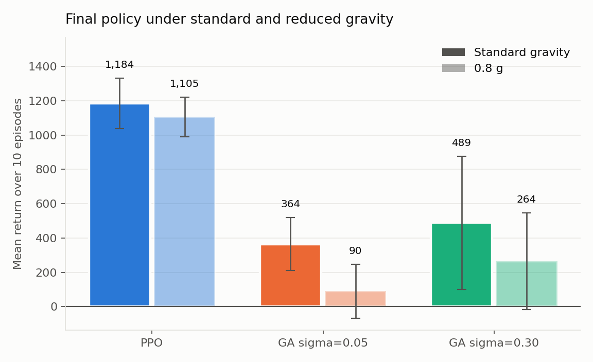

# Microbial GA vs PPO on HalfCheetah

Can gradient free evolutionary search keep up with deep reinforcement learning on a
continuous control task, and does either of them hold up when the physics change at
test time?

A microbial genetic algorithm evolving a linear controller is compared against PPO
on HalfCheetah-v4, with both given the same budget of 400,000 environment steps.
Both final policies are then re-evaluated with gravity scaled to 0.8 g.

The short answer is that PPO wins on both counts. The numbers, the statistics and
the caveats are in [RESULTS.md](RESULTS.md).



## Method

The GA keeps a population of 20 linear policies, each a 6x17 weight matrix mapping
observation to action. Each tournament picks two individuals at random, evaluates
both for one episode, and overwrites the loser with a recombination toward the
winner plus Gaussian mutation at rate sigma. The winner is left alone, which is what
makes it microbial rather than generational. Two mutation rates are compared, 0.05
and 0.30.

PPO is Stable-Baselines3 with an MlpPolicy, `n_steps=2048`, `batch_size=64`,
`learning_rate=3e-4`, running on CPU.

Every tournament costs exactly two episodes of 1,000 steps, so the GA's consumption
is known rather than estimated, and PPO gets trained to the same 400,000 steps.

Evaluation is ten episodes with a deterministic policy and fixed seeds, at standard
gravity and again at 0.8 g. Both methods go through the identical protocol.

## Running it

```bash
pip install -r requirements.txt
./run_all.sh
python analyse.py
```

`run_all.sh` runs three PPO seeds and six GA runs, which took about 25 minutes on
two cores. `analyse.py` produces the figures and the statistics.

Individual runs:

```bash
python run_ga.py  --sigma 0.05 --seed 0 --budget 400000
python run_ppo.py --seed 0 --budget 400000
```

## Layout

| Path | Contents |
|---|---|
| `common.py` | environment setup, the linear policy, rollouts, evaluation |
| `run_ga.py` | the microbial GA, saving the champion, final evaluation |
| `run_ppo.py` | PPO training with per episode logging, final evaluation |
| `analyse.py` | figures and Welch t-tests |
| `run_all.sh` | the full experiment |
| `logs/` | histories, champion weights, trained models, per run results |
| `figures/` | the generated plots |

Originally coursework for the Acquired Intelligence and Adaptive Behaviour module at
the University of Sussex, since rewritten. MIT licensed.
