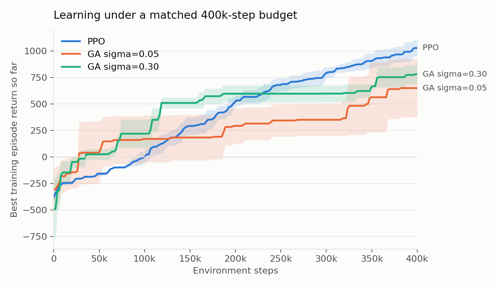

# Results

Three seeds for each configuration. Both methods get exactly 400,000 environment
steps. Each final policy is evaluated over ten episodes at standard gravity, then
again with the vertical gravity component scaled to 0.8 g, using the same fixed
evaluation seeds both times.

## The numbers

| Method | Standard gravity | 0.8 g | Change | Kept |
|---|---|---|---|---|
| PPO | 1,184 | 1,105 | -79 | 93% |
| GA sigma = 0.30 | 489 | 264 | -225 | 54% |
| GA sigma = 0.05 | 364 | 90 | -274 | 25% |

| Comparison | Condition | PPO | GA | t | p | Cohen's d |
|---|---|---|---|---|---|---|
| PPO vs GA sigma=0.05 | standard | 1,184 | 364 | 6.70 | 0.0026 | 5.47 |
| PPO vs GA sigma=0.05 | 0.8 g | 1,105 | 90 | 9.01 | 0.0012 | 7.35 |
| PPO vs GA sigma=0.30 | standard | 1,184 | 489 | 2.91 | 0.0752 | 2.38 |
| PPO vs GA sigma=0.30 | 0.8 g | 1,105 | 264 | 4.78 | 0.0229 | 3.90 |

Welch's t-test, n = 3 seeds per group.

### Per seed

The spread between seeds is wide for the GA, which is why the averages above come
with a caveat attached. GA sigma=0.30 seed 1 actually does better under reduced
gravity than it does at standard gravity.

| Method | Seed | Standard gravity | 0.8 g |
|---|---|---|---|
| GA sigma=0.05 | 0 | 244 | 117 |
| GA sigma=0.05 | 1 | 538 | 232 |
| GA sigma=0.05 | 2 | 310 | -79 |
| GA sigma=0.30 | 0 | 165 | -46 |
| GA sigma=0.30 | 1 | 383 | 507 |
| GA sigma=0.30 | 2 | 918 | 330 |
| PPO | 0 | 1,329 | 1,231 |
| PPO | 1 | 1,186 | 1,081 |
| PPO | 2 | 1,038 | 1,003 |




## What changed from the original version

I wrote this as coursework and came back to it later. The reduced gravity evaluation
had three things wrong with it.

The first is that selection wasn't doing anything. The evaluation function contained
this:

```python
if ri > rj:
    policy = mutate((wi + wj) / 2, mut)
else:
    policy = mutate((wi + wj) / 2, mut)
```

Both branches are the same line, so comparing the two fitnesses had no effect on
what happened next.

The second is that no trained policy was ever loaded. `run_cfg()` only saved the
per generation return history and never the weights, so the evaluation function
re-evolved a fresh policy from a seeded RNG and measured that instead, despite a
comment saying it was loading the final weights. The report said the final policies
were evaluated. They weren't. The report also said ten evaluation episodes where the
code used five.

The third is that the robustness claim had nothing behind it. The abstract said GA
sigma=0.05 "suffered a smaller proportional drop relative to its own baseline", but
there was no standard gravity GA evaluation anywhere in the code, so there was
nothing to take a proportion of.

There was also a separate problem with the learning curves. PPO's curve was a single
final return per seed drawn as a flat line across 200 generations, using
`[ppo_returns.mean()] * 200`, and the AUC was that flat line multiplied by 200. The
sample efficiency comparison was resting on that.

### What I fixed

Selection is now explicit. The loser gets overwritten by a recombination toward the
winner plus Gaussian mutation, and the winner is left intact, which is what makes it
a microbial GA in the first place.

The best individual found gets tracked, saved to an `.npz`, reloaded, and asserted
identical before it's evaluated.

Standard gravity evaluation was added, so the reduced gravity number has something
to be compared against.

Both methods now consume exactly 400,000 environment steps, counted rather than
assumed, so sample efficiency means something specific.

PPO episode returns are logged against environment steps during training.

### Conclusions that flipped

The original conclusion about robustness was backwards. PPO keeps 93% of its
standard gravity return under 0.8 g and GA sigma=0.05 keeps 25%, so PPO is better on
absolute return and on proportional retention. There's no trade off to report.

The mutation rate finding flipped too. The original argued that the bigger drop for
high sigma GA suggested it had overfitted to the default dynamics. With the champion
actually being loaded, sigma=0.30 keeps more of its performance (54%) than
sigma=0.05 does (25%).

GA returns are positive now where they used to be large and negative, because the
policy being evaluated is the one that was trained rather than a fresh re-evolution.

## Limitations

Three seeds per configuration isn't many. PPO against GA sigma=0.30 at standard
gravity comes out at p = 0.075, so I wouldn't call that one significant.

The GA evolves a linear controller while PPO trains an MLP, so this comparison
confounds the search algorithm with the policy class. Some of PPO's advantage here
is about representation rather than about the algorithm, and controlling for that
would be the first thing to do next.

Both learning curves report the best episode seen so far, which is optimistic
compared to average performance for either method.

There's one perturbation, 0.8 g, on one environment. Robustness to a single change
in gravity is weak evidence about robustness in general.
